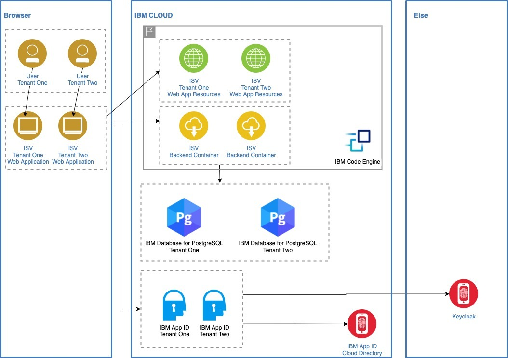
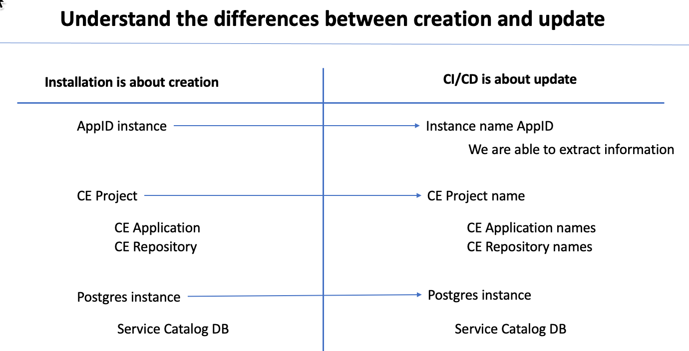

# Multi tenancy

**------------------**
**UNDER CONSTRUCTION**
**------------------**

### Multi-tenancy projects

* [Serverless](https://github.com/karimdeif/multi-tenancy)
* [OpenShift](https://github.com/kleniu/openshift-multi-tenancy)
* [Satellite]()

### Target architecture `serverless`:

One frontend per tenant, one business logic per tenant.

### Objectives for sprint in week 41 `serverless`

These are the main objectives for this sprint.

#### 1 **Running simple ecommerce application on Code Engine**

  * App ID is configured
  * Frontend is integrated with AppID
  * Backend is integrated with AppID
  * Backend is integrated postgres
  * Postgres is setup

#### 2  **Automation of the deployment**
    
  * Installation and setup is about **creation**
  * CI/CD is about **update**

  * Differences creation and update

  

  * Dependencies creation and update

  

#### 3  **Documenation of the setup**

### Table of tasks

* Project tasks/activities in [ZenHub link](https://github.com/karimdeif/multi-tenancy#workspaces/serverless-6152c725095153001243b1aa/board?repos=388999110)

|   | Objectives |  Status | Priority |  Notes | 
|---|---|---|---|---|
| 1 | **Running simple ecommerce application including Quarkus on Code Engine** |  in progress | high |Running example: [tenant b](https://frontend-oidc-b.ceqctuyxg6m.us-south.codeengine.appdomain.cloud/), [tenant a](https://frontend-oidc-a.ceqctuyxg6m.us-south.codeengine.appdomain.cloud/)  |
| 1.0 | - Create a folder for the source code of the applications called **code** |  **done** | high | Inside the folder the name on the subfolders should refect the appliation name. |
| 1.1 | - AppID setup |  **done** | high |  |
| 1.2 | - AppID integration to frontend |  **done** | high |  |
| 1.3 | - AppID integration to Backend |  open | high |  |
| 1.4 | - Backend database postgres integration |  done | high |  |
| 1.5 | - Deploy to Code Engine |  in progress | high | the intergrated appid frontend and postgress backend is deployed |
| 2 | **Automation of the deployment** | in progress | high |  |
| 2.0 | - Define a folder structure for the **installation/setup and CI/CD** | **done** | high | one folder call **installapp** (first time installation) **cicd** (continuous delivery realization with tekton) |
| 2.1 | - Create containers and save them in a public container registry | open | high |  |
| 2.2 | - Create a bash automation for the creation and configuration of AppID | inprogress | high | Thomas need to copy the work he did the the project. |
| 2.3 | - Create a bash automation for the creation and configuration of postgres | open | high |  |
| 2.4 | - Create a bash automation for deployment to Code Engine | in progress | high |  |
| 2.5 | - Setup tekton using the IBM Cloud toolchain | in progress | high |  |
| 2.6 | - Integrate exiting bash automations to tekton pipeline | open | high |  |
| 2.7 | - Add an admin UI for onboarding of new tenant roberts application |  open | low |  |
| 2.7 | - Problem to start the frontend container in code engine |  open | high |  |
| 3 | **Documenation of the setup** | open | high | We should use **mkdocs** |  
| 3.1 | - Manual setup | open | high |  |  
| 3.2 | - Automation setup | open | high |  |
| 3.3 | - Workshop  | open | low |  |

### Technology Used

The example ecommerce mircorservices application is build on following `technologies/tools/frameworks`.

  * [Microservices architecture](https://en.wikipedia.org/wiki/Microservices)
  * [OpenID Connect](https://openid.net/connect/)
  * [Jakarta EE](https://jakarta.ee/)
  * [MicroProfile](https://microprofile.io/)

  * [IBM Cloud Code Engine](https://cloud.ibm.com/docs/codeengine?topic=codeengine-about)
  * [Postgres](https://cloud.ibm.com/databases/databases-for-postgresql/create)
  * [AppID](https://www.ibm.com/de-de/cloud/app-id)
  * [Quarkus](https://quarkus.io/ingress)
  * [Vue.js](https://vuejs.org/)
  
  * [NGINX](https://www.nginx.com/)
  * [git 2.24.1 or higher](https://git-scm.com/book/en/v2/Getting-Started-Installing-Git)
  * [yarn 1.22.4 or higher](https://yarnpkg.com)
  * [Node.js v14.6.0 or higher](https://nodejs.org/en/)
  * [Apache Maven 3.6.3](https://maven.apache.org/ref/3.6.3/maven-embedder/cli.html)
  * [Quay](https://quay.io/)
  * [Tekton](https://tekton.dev/)