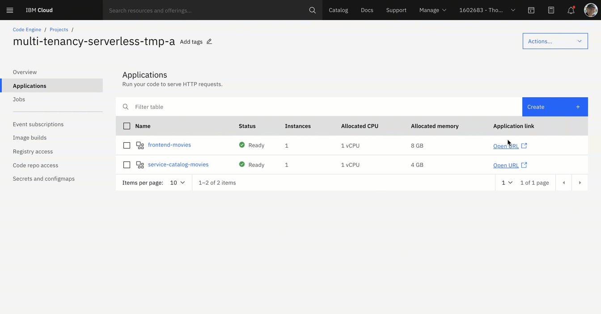

# Lab 1: Setup e-commerce example application on IBM Cloud

**------------------**
**UNDER CONSTRUCTION**
**------------------**

### IBM Cloud Account

#### Step 1: Create a `PayAsYouGo` IBM Cloud Account

Open this [link](https://ibm.biz/BdfXAn) and follow the guided steps.

`Code Engine` has a `free tier` per month and we expect, if you haven't used that `free tier` in current month, you can execute the workshop without creating any additional costs. Here you find the actual [`Code Engine` pricing](https://www.ibm.com/cloud/code-engine/pricing).

### `IBM Cloud Shell`

#### Step 1: Open the `IBM Cloud Shell`

When using the IBM Cloud Shell, no client-side setup is required for this workshop, it comes with all necessary CLIs (command line tools).

Use following link to directly open the `IBM Cloud Shell`.

<https://cloud.ibm.com/shell>

In your browser, login to the [IBM Cloud](https://cloud.ibm.com) Dashboard and open the IBM Cloud Shell from here:


_Note:_ Your workspace includes 500 MB of temporary storage. This session will close after an hour of inactivity. If you don't have any active sessions for an hour or you reach the 50-hour weekly usage limit, your workspace data is removed.

#### Step 2: `IBM Cloud Shell`

Now you are logged on with your IBM Cloud account.


### Run automated setup

#### Step 1: Clone the GitHub project to the `IBM Cloud Shell`

Insert these commands to clone the GitHub project to the `IBM Cloud Shell`.

```sh
git clone https://github.com/karimdeif/multi-tenancy.git
cd multi-tenancy
export ROOT_FOLDER=$(pwd)
```

#### Step 2: Inspect the default configuration of the setup bash scripts

Prerequiste to run the bash scripts for the setup:

* The container images for the applications need to be available.
* Verify the default settings for the script execution.

The `ce-create-two-tenantcies.sh` script has following default parameters for **Code Engine**, **Applications**, **container registry**, **AppID** and **Postgres**.

*  Code Engine

```sh
export PROJECT_NAME_A=multi-tenancy-serverless-a
export PROJECT_NAME_B=multi-tenancy-serverless-b
```

* Applications

```sh
export SERVICE_CATALOG_NAME_A="service-catalog-movies"
export FRONTEND_NAME_A="frontend-movies"

export SERVICE_CATALOG_NAME_B="service-catalog-fantasy"
export FRONTEND_NAME_B="frontend-fantasy"

export CATEGORY_A=Movies
export CATEGORY_B=Fantasy
```

* IBM CLoud container registry

```sh
export SERVICE_CATALOG_IMAGE="us.icr.io/multi-tenancy-cr/service-catalog:latest"
export FRONTEND_IMAGE="us.icr.io/multi-tenancy-cr/frontend:latest"
```

* App ID

```sh
export APPID_SERVICE_INSTANCE_NAME_A="multi-tenancy-serverless-appid-a"
export APPID_SERVICE_KEY_NAME_A="multi-tenancy-serverless-appid-key-a"

export APPID_SERVICE_INSTANCE_NAME_B="multi-tenancy-serverless-appid-b"
export APPID_SERVICE_KEY_NAME_B="multi-tenancy-serverless-appid-key-b"
```

* Postgres

```sh
export POSTGRES_SERVICE_INSTANCE_A=multi-tenant-pg-a
export POSTGRES_SERVICE_INSTANCE_B=multi-tenant-pg-b
```

#### Step 3: Execute following bash automation

> Don't worry, this script may take several minutes (10 - 15 min) without portgres. With postgres it will take up to 30 mins.

* Execute following bash script:

```sh
cd $ROOT_FOLDER/installapp
bash ce-create-two-tenantcies.sh
```

* What happens behind the curtain?

The bash script `ce-create-two-tenantcies.sh` invokes **twice** the bash script `ce-install-application.sh` with the needed parameter to create two seperated tenant applications. Here is a short simplified description which steps are carried out currently in the script `ce-install-application-ibmcr.sh`:

 1. Configure IBM Cloud configuration for targets like $REGION and create an [Code Engine CLI](https://cloud.ibm.com/docs/codeengine?topic=codeengine-cli) project
 2. Configure container the IBM Cloud container registry access in the Code Engine project
 3. Create Postgres instance and database
 4. Create an [`App ID`](https://cloud.ibm.com/docs/appid) service instance
 5. Configure the AppID service instance and use the [App ID REST API](https://cloud.ibm.com/apidocs/app-id/management#introduction) to configure: **application**, **scope**, **roles**, **users**, **login**,  **logo** and **color**.
 6. Create `service catalog` application in the **Code Engine** project
 7. Create `frontend` application in the **Code Engine** project
 8. Add `redirect URI` for the Frontend to **AppID**
 9. Verify **Code Engine** application deployments
 10. Show container logs of the applications
 11. Showing the URLs

 After the exection of the script you find your IBM Cloud account:

 - Two **App ID service instances** which do include an user with the **username** `thomas@example.com` and **password** `thomas4appid`
 - Two **Code Engine projects** with a fontend and a backend application and an configured access for the IBM Cloud container registry of your account.

 > Note: We using at the moment a preconfigured **Postgres database** running on IBM Cloud, which is maybe not in your cloud account.

### Verify the setup

#### Step 1: Open following url `https://cloud.ibm.com/resources`

In resource list of in the IBM Cloud UI, insert as filter for **name** the value `multi`. Now you should see following in your IBM Cloud Account:


#### Step 2: Open App ID instance for `tenant a` and inspect the configuration


#### Step 3: Open Code Engine project for `tenant a` and inspect the configuration

#### Step 4: Open the frontend application for `tenant a` in the Code Engine project

#### Step 5: Click on URL and logon to the frontend application using **username** `thomas@example.com` and **password** `thomas4appid`



#### Step 6: Repeat the steps for `tenant b`


