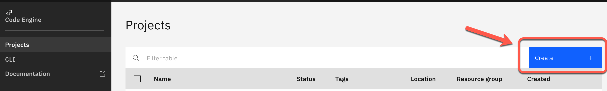

# Lab 1: Setup e-commerce example application on IBM Cloud

**------------------**
**UNDER CONSTRUCTION**
**------------------**

### IBM Cloud Account

#### Step 1: Create a `PayAsYouGo` IBM Cloud Account

Open this [link](https://ibm.biz/BdfXAn) and follow the guided steps.

`Code Engine` has a `free tier` per month and we expect, if you haven't used that `free tier` in current month, you can execute the workshop without creating any additional costs. Here you find the actual [`Code Engine` pricing](https://www.ibm.com/cloud/code-engine/pricing).

### Create `Code Engine` project

#### Step 1: Logon to IBM Cloud and navigate to the Code Engine projects

Use following link to directly navigate to the Code Engine projects in IBM Cloud.

<https://cloud.ibm.com/codeengine/projects>

#### Step 2: Navigate to Code Engine projects in IBM Cloud and press `Create`



#### Step 3: Create a `Code Engine` project called `multi-tenancy-[YOUR-EXTENTION]`

Enter following values and select create and wait until your project is created.

* Location      : `Dallas`
* Name          : `multi-tenancy-[YOUR-EXTENTION]` (The name must be unique in the in Cloud Location `Dallas`)
* Resource group: `default`

### `IBM Cloud Shell`

#### Step 1: Open the `IBM Cloud Shell`

When using the IBM Cloud Shell, no client-side setup is required for this workshop, it comes with all necessary CLIs (command line tools).

Use following link to directly open the `IBM Cloud Shell`.

<https://cloud.ibm.com/shell>

In your browser, login to the [IBM Cloud](https://cloud.ibm.com) Dashboard and open the IBM Cloud Shell from here:


_Note:_ Your workspace includes 500 MB of temporary storage. This session will close after an hour of inactivity. If you don't have any active sessions for an hour or you reach the 50-hour weekly usage limit, your workspace data is removed.

#### Step 2: `IBM Cloud Shell`

Now you are logged on with your IBM Cloud account.


#### Step 1: Clone the GitHub project to the `IBM Cloud Shell`

Insert these commands to clone the GitHub project to the `IBM Cloud Shell`.

```sh
git clone https://github.com/karimdeif/multi-tenancy.git
cd multi-tenancy
export ROOT_FOLDER=$(pwd)
```

#### Step 2: Now set the environment variable for later usage

> REMEMBER! Your Code Engine project name `multi-tenancy-[YOUR-EXTENTION]`

```sh
export MYPROJECT=multi-tenancy-[YOUR-EXTENTION]
```

#### Step 3: Execute following bash automation

> Don't worry, this script may take several minutes (10 - 15 min).

* Use of IBM Cloud container registry 

```sh
cd $ROOT_FOLDER/installapp
bash ce-create-two-tenantcies.sh
```

The `ce-create-two-tenantcies.sh` invokes twice the bash scipt `ce-install-application-ibmcr.sh` with the needed parameter to create two seperated tenant applications.

For a better understanding here are the simplified steps that are carried out in the script `ce-install-application-ibmcr.sh` does:

 1. Configure CLI config and create an [Code Engine CLI](https://cloud.ibm.com/docs/codeengine?topic=codeengine-cli) project
 2. Configure container the IBM Cloud container registry access in the Code Engine project
 3. Create Postgres instance and database
 4. Create an [`App ID`](https://cloud.ibm.com/docs/appid) service instance
 5. Configure the AppID service instance and use the [App ID REST API](https://cloud.ibm.com/apidocs/app-id/management#introduction) to configure: **application**, **scope**, **roles**, **users** and **login**
 6. Create `service catalog` application in the Code Engine project
 7. Create `frontend` application in the Code Engine project
 8. Add redirect URI for the Frontend to AppID
 9. Verifing deployments
 10. Show container logs of the applications
 11. Showing the URLs


